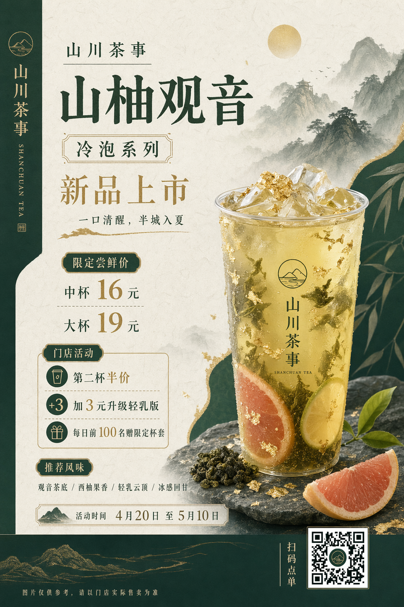
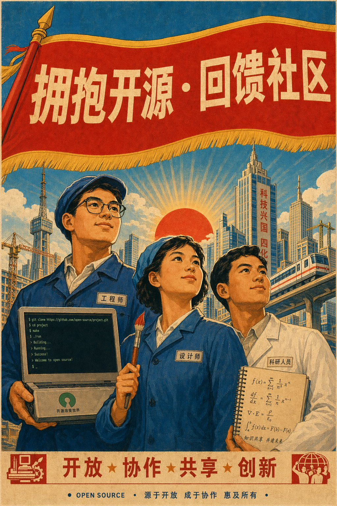
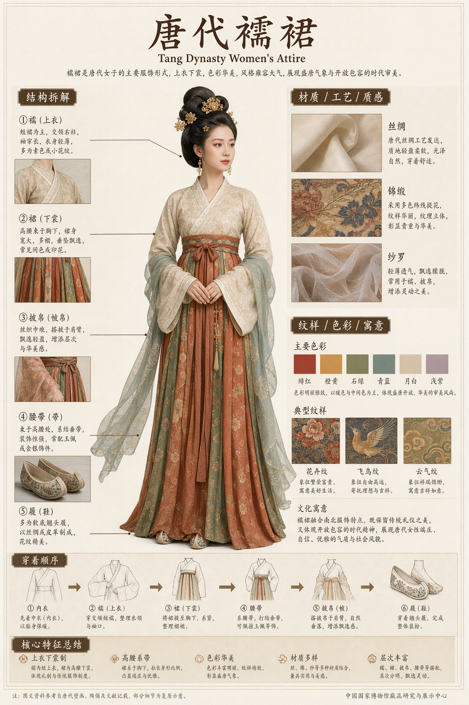
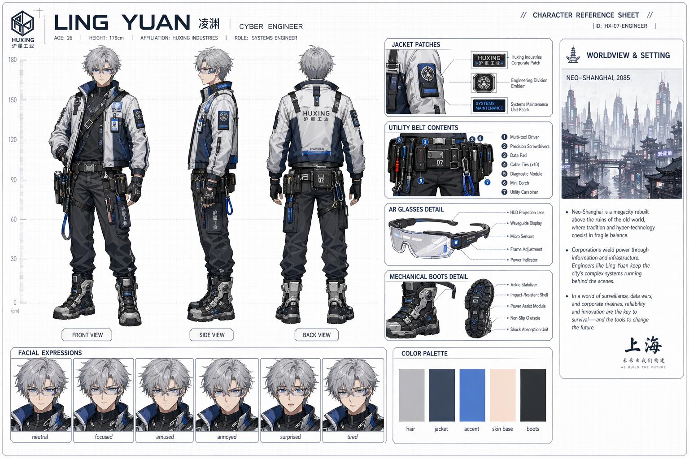
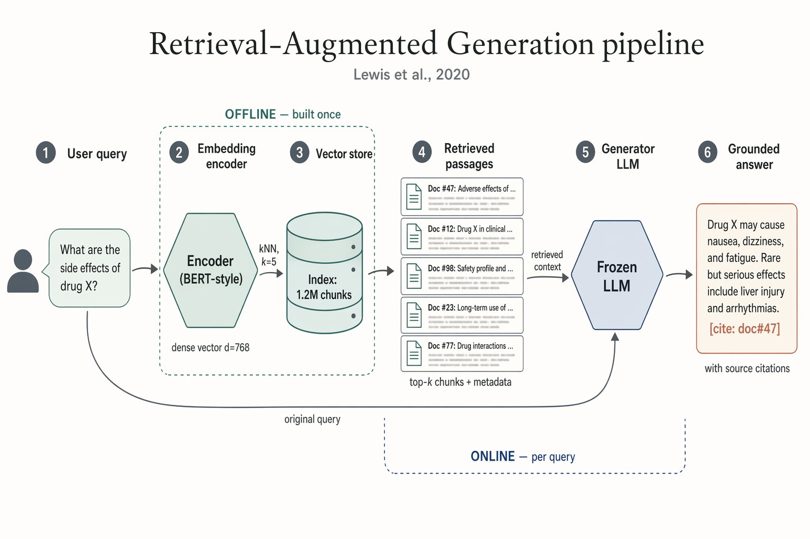
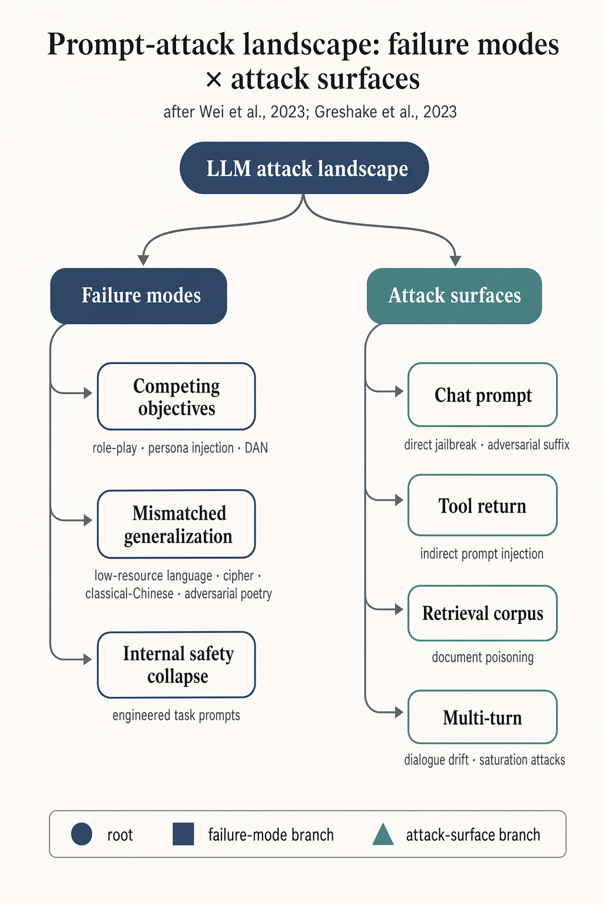

# gpt-2-image-skill

A Claude Skill + CLI for **OpenAI GPT Image 2** (`gpt-image-2`), with a curated prompt gallery for the hard stuff: dense Chinese typography, photorealism, posters, infographics, character sheets, and image editing.

Drop it into any skill-aware agent runtime (Claude Code, Hermes, etc.) or just call the script directly from the shell.



## What you get

```
gpt-2-image-skill/
├── SKILL.md                  # Claude Skill spec: triggers, CLI reference, examples
├── scripts/
│   └── generate.py           # Self-contained PEP 723 uv script, no venv needed
└── references/
    ├── craft.md              # 12 prompt-craft principles for GPT Image 2
    └── gallery.md            # 56 community-curated prompt patterns, 8 categories
```

- **`SKILL.md`** — Frontmatter + CLI table. Claude loads this automatically when image-generation intent is detected; other agents can read it as Markdown.
- **`scripts/generate.py`** — One Python file. Every documented API parameter exposed as a flag. Uses raw `httpx` (no SDK pinning), so new API params keep working.
- **`references/`** — Optional deep material. Loaded on demand when the request signals a matching category.

## Install

### Option A: User-scope Claude Skill

```bash
git clone https://github.com/<your-handle>/gpt-2-image-skill ~/.claude/skills/gpt-image
```

Claude Code auto-discovers `~/.claude/skills/*/SKILL.md`. Restart the session and Claude will surface the skill on any image-gen intent.

### Option B: Standalone CLI

```bash
git clone https://github.com/<your-handle>/gpt-2-image-skill ~/tools/gpt-2-image-skill
export OPENAI_API_KEY=sk-...
uv run ~/tools/gpt-2-image-skill/scripts/generate.py -p "a cat astronaut"
```

The PEP 723 header pulls `httpx` + `python-dotenv` automatically on first run; no separate venv or `pip install` needed. Requires [`uv`](https://github.com/astral-sh/uv) and Python ≥ 3.11.

## Showcase

All of the images below were produced in one shot by the skill at `--quality high`, with no manual edits. Prompt texts live under [`docs/`](docs/) so you can reproduce them.

### Commercial & editorial design

<table>
<tr>
<td width="50%" valign="top">

<br><strong>Chinese commercial typography</strong><br>
<em>3:4 tea-launch poster, 17 exact-copy strings, New Chinese light-luxury palette, rice-paper texture. Price tiers, gift modules, fine print — all correctly rendered.</em>
</td>
<td width="50%" valign="top">

<br><strong>Stylised period design + slogan</strong><br>
<em>1980s Chinese propaganda poster, exact slogan "拥抱开源 · 回馈社区", three-character hero composition with laptop / paintbrush / notebook. Red-gold-blue palette, paper grain.</em>
</td>
</tr>
<tr>
<td valign="top">

<br><strong>Museum-catalog infographic</strong><br>
<em>唐代襦裙 disassembly board — structural callouts, material swatches, pattern-meaning modules, numbered dressing flow. Dense Simplified-Chinese annotations throughout.</em>
</td>
<td valign="top">

<br><strong>RAW iPhone photorealism</strong><br>
<em>42nd Street subway, train in motion blur, elderly couple on the platform. Fluorescent ceiling wash, natural imperfections, no filter — the quintessential "unprocessed capture" look.</em>
</td>
</tr>
<tr>
<td colspan="2" valign="top">

<br><strong>Character reference sheet with cross-view consistency</strong><br>
<em>Neo-Shanghai 2085 — front/side/back three-view, six-expression grid, jacket / utility-belt / AR-glasses / boots callouts, five-swatch color palette, worldview panel. Face shape, hairstyle, and outfit stay identical across views.</em>
</td>
</tr>
</table>

### Research-paper figures

Paper-ready figures for ML/AI publications. Muted academic palette, flat vector style, crisp labels — the kind of Figure 1 you'd send to NeurIPS, ICML, or ICLR camera-ready.

<table>
<tr>
<td width="50%" valign="top">

<br><strong>Transformer architecture block diagram</strong><br>
<em>Encoder / decoder dual-stack with residual connections, multi-head self-attention, cross-attention with "keys, values" link, positional encoding, Linear → Softmax head. Camera-ready Vaswani-style layout.</em>
</td>
<td width="50%" valign="top">

<br><strong>RAG systems diagram</strong><br>
<em>Six-stage left-to-right pipeline: user query → embedding encoder → vector store → retrieved passages → frozen LLM → grounded answer with inline citation. Offline / online regions marked with dashed outlines.</em>
</td>
</tr>
<tr>
<td valign="top">

<br><strong>LLM safety taxonomy tree</strong><br>
<em>3:4 hierarchy diagram of prompt-attack landscape: root → failure modes (competing objectives / mismatched generalization / internal safety collapse) × attack surfaces (chat prompt / tool return / retrieval corpus / multi-turn). Academic citation style.</em>
</td>
<td valign="top">

<br><strong>Diffusion forward / reverse chain</strong><br>
<em>Canonical DDPM-style figure: top chain shows progressive Gaussian noise corruption x₀ → x_T; bottom chain shows learned reverse denoising with ε_θ(x_t, t) blocks between frames. Loop-closing arrows label "T diffusion steps" and "sample x₀".</em>
</td>
</tr>
</table>

## Quick reference

### Primary path — conversational (Claude Code, Codex, Cline, etc.)

Once the skill is installed, you have two equivalent ways to trigger it:

**(a) Slash command** — explicit, short:

```
/gpt-image a photorealistic convenience store at 10pm, 1024x1024

/gpt-image Design a 3:4 Chinese tea-launch poster. Exact copy:
"山川茶事" / "冷泡系列" / "中杯 16 元" / "大杯 19 元".
Dark green / off-white / gold, rice-paper texture.

/gpt-image colorize ./fig/manga-page.jpg and translate text to Chinese

/gpt-image combine fig/cat.png and fig/kfc_logo.png into a collab poster
```

Everything after `/gpt-image` is the prompt. Agents parse paths out of the prompt — any `.png` / `.jpg` it sees becomes an `-i` reference image for the edit endpoint.

**(b) Natural language** — skill auto-loads on image-gen intent, no slash needed:

```
you:   Generate a photorealistic convenience-store-at-night photo, 1K square.
agent: [loads gpt-image skill, runs scripts/generate.py, returns PNG path]

you:   Colorize ./fig/manga-page.jpg and translate the text to Chinese.
agent: [detects reference image → edits endpoint,
        calls generate.py -i fig/manga-page.jpg]
```

Tips for either form:
- Put **exact displayed text in quotes** — the agent will preserve it verbatim through to the API call.
- Mention **aspect / size** upfront (`3:4`, `2K`, `landscape`) — the agent maps this to the right `--size` flag.
- Mention a **reference image path** to trigger the edit endpoint; mention a **mask** to trigger inpainting.
- If you want the agent to iterate cheaply while you workshop the prompt, say "use quality low first" — the skill default is `high`.

### Secondary path — direct CLI

For scripting, CI, or batch jobs you can call the script yourself:

```bash
# vanilla generate, auto filename, 1K square, high quality (default)
uv run generate.py -p "a photorealistic convenience store at 10pm"

# 3:4 portrait poster with exact Chinese copy
uv run generate.py \
  -p 'Design a 3:4 tea poster. Exact copy: "山川茶事" / "冷泡系列" / "中杯 16 元"' \
  --size portrait -f poster.png

# edit / colorize existing image
uv run generate.py -p "colorize and translate to Chinese" -i page.jpg -f out.png

# multi-reference brand collab
uv run generate.py -p "cat × KFC poster" -i cat.png -i kfc_logo.png -f collab.png

# masked inpaint
uv run generate.py -p "replace sky with aurora" -i photo.jpg -m sky_mask.png -f out.png

# 4K widescreen, cheap preview
uv run generate.py -p "Shanghai skyline" --size 4k --quality low -f draft.png
```

Full flag table and size shortcuts live in [`SKILL.md`](SKILL.md).

## API-key resolution

The script reads `OPENAI_API_KEY` in this order, with later entries winning:

1. process env (`export OPENAI_API_KEY=...`)
2. `./.env` in cwd
3. `~/.env` in home (override-on, so this is the source of truth when present)

Put the key wherever fits your workflow — dotenv users don't need to re-export on every shell.

## Design notes

- **Defaults bias quality.** `--quality high` is default because GPT Image 2's typography and fine-detail rendering degrade noticeably below it. Use `--quality low` for quick iteration.
- **Raw HTTP, no SDK.** The script uses `httpx` directly, so every parameter the API documents (including newer ones like `background`, `moderation`, `output_format`, `partial_images`) is forwarded verbatim. No waiting for SDK releases.
- **Endpoint auto-selected.** Pass `-i` once or more to switch from `/v1/images/generations` to `/v1/images/edits` (multipart form). Add `-m` for alpha-channel inpainting.
- **Progressive disclosure.** `SKILL.md` is ~120 lines (fits in an agent's context). Load `references/gallery.md` only when the request matches a category.

## Attribution

Prompt patterns curated from [`ZeroLu/awesome-gpt-image`](https://github.com/ZeroLu/awesome-gpt-image) under CC BY 4.0. Every entry in `references/gallery.md` preserves its original `Source: @handle` tag. The skill's `SKILL.md`, `craft.md`, and `generate.py` are released under CC BY 4.0 as well — keep the attribution intact when you fork, vendor, or publish derivatives.

## License

CC BY 4.0 — see [`LICENSE`](LICENSE).
